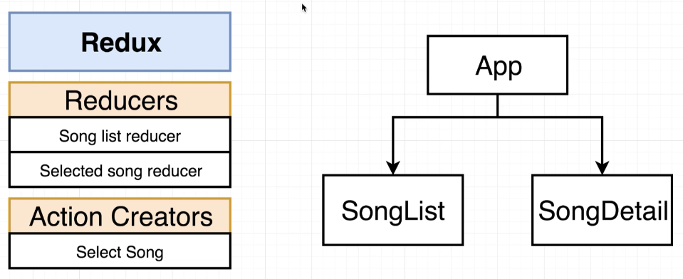

# Song Select

Welcome to the Song Select page!

This app will include:
- an **Action** Creator to select a song.
- a **reducing** function which will create a list of songs, and the currently selected song. 
-   Song list reducer: static list of songs.
-   Currently selected song reducer: picks from the static list of songs.

Components:
- App: main component
- SongList: list of songs
- SongDetails: details of the currently selected song
- 

# App Structure

- /src
  - /action 
    - Contains files related to action creators.
    - creates an action (JavaScript object).
  - /components
    - Contains files related to components.
  - /reducers
    - Contains files related to reducers.
    - Receive, change, and return state.
  - index.js
    - sets up both the react and redux sides of the app.